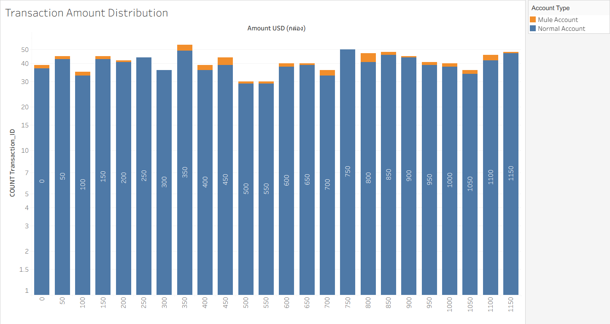
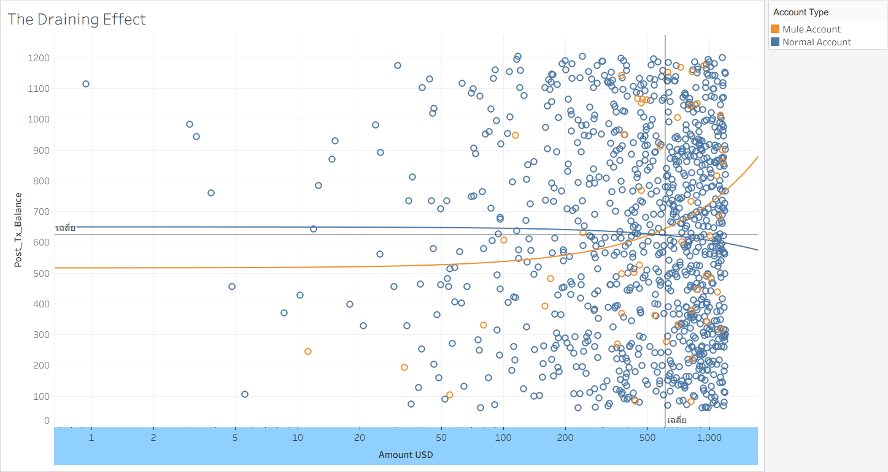
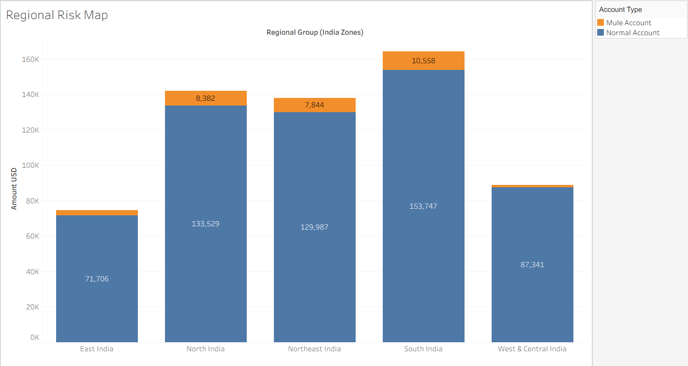
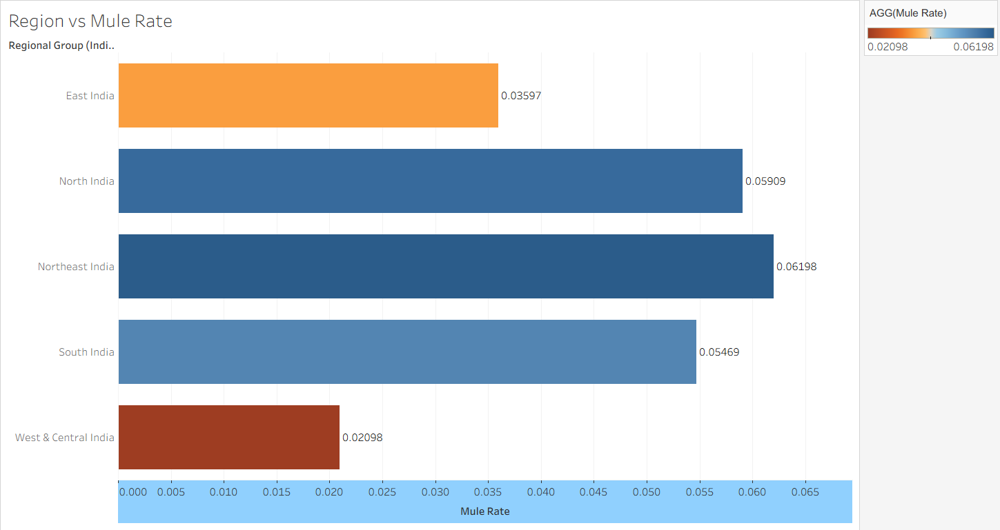
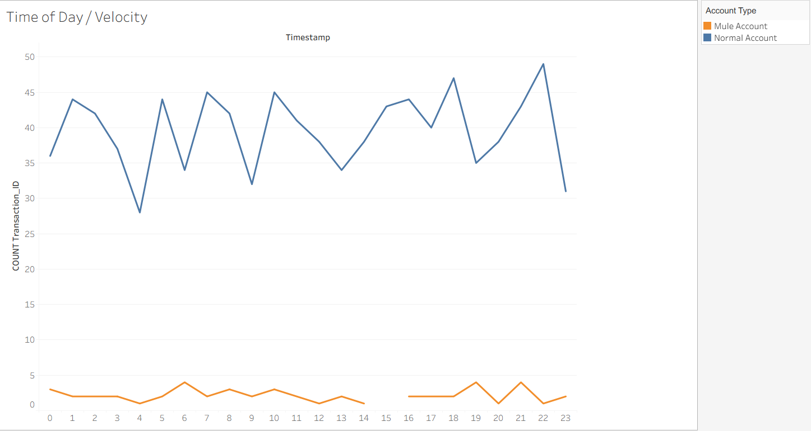
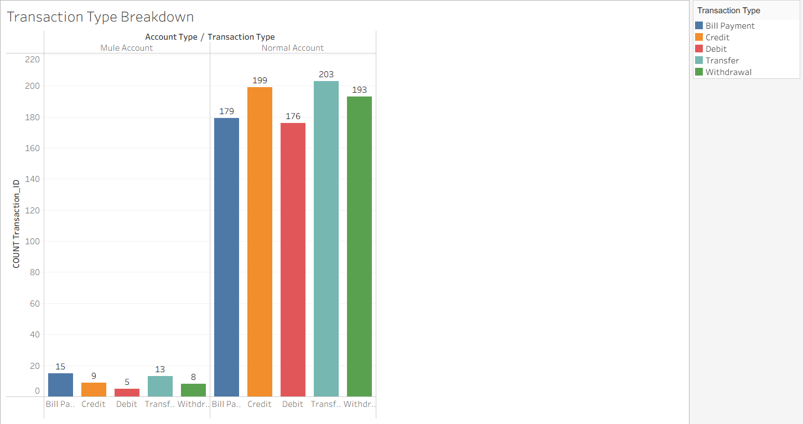
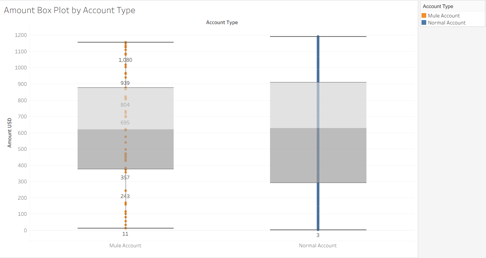
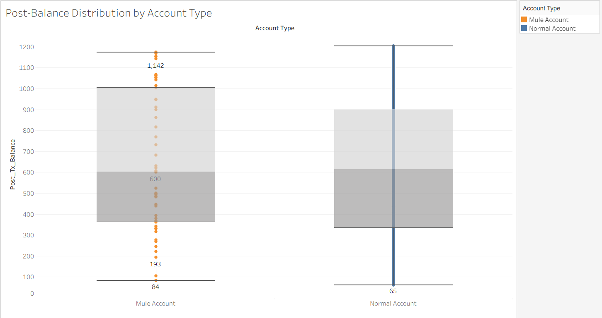

# 🔍 Bank Transaction Fraud Detection
**DE471 | Data Analytics Project**
**ศุภวิชญ์ 187 · ปุญญพัฒน์ 176 · ศิวกร 253**

---

## 1. บทนำและความเป็นมา (Introduction & Background)

ธนาคารในปัจจุบันเผชิญกับภัยคุกคามจากอาชญากรรมทางการเงินในรูปแบบ **APP Fraud (Authorized Push Payment)** ซึ่งผู้ทุจริตใช้ **"บัญชีม้า (Mule Accounts)"** เป็นช่องทางรับและโอนเงินที่ได้จากการหลอกลวง ก่อให้เกิดความสูญเสียทางการเงินและผลกระทบด้าน AML Compliance

ความท้าทายสำคัญคือบัญชีม้าถูกออกแบบมาให้ดูเหมือนบัญชีปกติ ทำให้ระบบตรวจจับแบบเดิมไม่สามารถแยกแยะได้ โปรเจกต์นี้จึงใช้การวิเคราะห์ **Behavioral Pattern** จากประวัติธุรกรรมเพื่อระบุและระงับความเสียหายได้ทันท่วงที

---

## 2. SMART Objectives

| | Objective |
|---|---|
| **S** | ตรวจจับบัญชีม้าจากพฤติกรรม Transaction Type, Off-hour Activity และ Regional Pattern |
| **M** | Detection Rate ครอบคลุม Mule 5% ของระบบ — False Positive Rate ≤ 1% |
| **A** | ใช้ Rule-based Alerts จาก EDA โดยไม่ต้องพึ่ง ML ในระยะแรก |
| **R** | ป้องกันเงินทุจริตรวมมูลค่า **$31,029** ที่ตรวจพบในชุดข้อมูล |
| **T** | ภายใน 1 ไตรมาส |

---

## 3. คำถามการวิจัย 5W1H (Research Questions)

| | คำถาม | สมมติฐาน |
|---|---|---|
| **WHO** | ใครคือกลุ่มบัญชีที่มีพฤติกรรมเสี่ยง? | Mule Account คิดเป็น 5% (50/1,000) ของระบบ |
| **WHAT** | พฤติกรรมอะไรที่แยก Mule ออกจากบัญชีปกติ? | Mule เน้น Bill Payment + Transfer รวมกัน 56% ต่างจาก Normal ที่กระจายเท่ากัน |
| **WHERE** | ภูมิภาคไหนมี Mule Rate สูงสุด? | Northeast และ North India มี Mule กระจุกตัวสูงสุดรวมกัน 56% |
| **WHEN** | ธุรกรรมผิดปกติเกิดขึ้นเมื่อไหร่? | 38% ของ Mule transactions เกิดในช่วง Off-hours (22:00–06:00 น.) |
| **WHY** | ทำไมต้องตรวจจับเร็ว? | เพื่อป้องกันเงินทุจริตรวม $31,029 ก่อนหลุดออกจากระบบ |
| **HOW** | Mule โอนเงินต่างจากปกติอย่างไร? | Amount median ของ Mule ($618.89) ≈ Normal ($627.33) — Mule ออกแบบมาให้ตรวจจับยาก ต้องใช้ Behavioral Pattern แทน |

---

## 4. ชุดข้อมูลและตัวแปร (Dataset & Features)

- **แหล่งข้อมูล:** [Bank Transaction Fraud Detection — Kaggle](https://www.kaggle.com/) (Indian Banking Data)
- **จำนวนแถว:** 1,000 rows (Stratified Sample จาก 200,000 rows)
- **สัดส่วน:** Mule Account 50 rows (5%) / Normal Account 950 rows (95%)
- **สกุลเงิน:** แปลงจาก INR → USD (÷83)

### Data Dictionary

| Column | Type | Description |
|--------|------|-------------|
| Transaction_ID | Integer | รหัสอ้างอิงเฉพาะของแต่ละธุรกรรม |
| Timestamp | Datetime | วันและเวลาที่เกิดธุรกรรม |
| Account_ID | String | รหัสบัญชีของผู้ทำธุรกรรม |
| Customer_Age | Integer | อายุของเจ้าของบัญชี |
| Gender | String | เพศของเจ้าของบัญชี |
| Region | String | เมืองและรัฐที่ทำธุรกรรม (City, State) |
| Transaction_Type | String | ประเภทธุรกรรม (Transfer, Bill Payment, Debit, Withdrawal, Credit) |
| Amount_USD | Float | จำนวนเงินที่โอน (USD) |
| Post_Tx_Balance | Float | ยอดเงินคงเหลือหลังทำธุรกรรม (USD) |
| Merchant_Category | String | หมวดหมู่ของธุรกรรม |
| Device_Type | String | อุปกรณ์ที่ใช้ทำธุรกรรม (Mobile, ATM, POS, Desktop) |
| **Account_Type** | String | **Target Variable** — Normal Account / Mule Account |

---

## 5. Data Preparation

### 5.1 การเตรียมข้อมูล

- ทำ **Stratified Random Sampling** เพื่อรักษาสัดส่วน Mule/Normal ให้สมจริง
- **ไม่ตัด Outlier** เพราะใน Fraud Detection ค่า outlier = fraud signal สำคัญ การตัดออกจะทำลาย fraud signal โดยตรง
- Group Region จาก City/State → 5 India Zones เพื่อตอบคำถาม WHERE

### 5.2 Class Imbalance

ชุดข้อมูลมีความไม่สมดุลตามธรรมชาติของ Fraud Detection จริง:

```
Normal Account : 950 rows (95.0%)
Mule Account   :  50 rows  (5.0%)
```

จัดการด้วยเทคนิค **Log Scale** บนกราฟเพื่อให้มองเห็น Mule (กลุ่มน้อย) ได้ชัดขึ้น

---

## 6. Exploratory Data Analysis (EDA)

### 6.1 Transaction Amount Distribution
> **คำถาม:** Amount ของ Mule ต่างจาก Normal อย่างไร?



จากกราฟ (Log Scale บนแกน Y) พบว่า **Mule (ส้ม) กระจายปนอยู่กับ Normal (น้ำเงิน) ในทุก bin ตลอด $0–$1,150** โดยไม่มีช่วงใดช่วงหนึ่งที่ Mule กระจุกตัวเป็นพิเศษ ยืนยัน **Camouflage Effect** ว่า Mule ถูกออกแบบมาให้ดูเหมือน Normal — ไม่สามารถตรวจจับได้ด้วย Amount อย่างเดียว

> **Median Amount:** Mule = $618.89 vs Normal = $627.33 (ต่างกันเพียง $8.44)

---

### 6.2 The Draining Effect (Scatter Plot)
> **คำถาม:** บัญชีม้ามีพฤติกรรม 'ล้างบัญชี' หลังทำธุรกรรมหรือไม่?



จากกราฟ Scatter Plot (Log Scale บนแกน X) พบว่า Mule (ส้ม) กระจายปนกับ Normal ทั่วทุก quadrant ซึ่งต่างจาก dataset เก่าที่แยกชัดเจน สะท้อนความสมจริงของข้อมูล **Trend line ของ Mule ชันขึ้น** — ยิ่งโอนมาก Balance กลับสูงขึ้นด้วย แสดงว่า Mule ยังไม่ drain ทันที แต่สะสมก่อนโอนรวดเดียว

> **Mean Post_Tx_Balance:** Mule = $646.74 vs Normal = $622.64

---

### 6.3 Regional Risk Map
> **คำถาม:** ปลายทางของเม็ดเงินทุจริตกระจุกตัวอยู่ที่ภูมิภาคใดมากที่สุด?



กราฟแสดง SUM Amount USD จำแนกตาม 5 India Zones พบว่า Mule (ส้ม) กระจายอยู่ใน 3 zones หลัก ไม่ได้กระจุกที่ zone เดียวเหมือน dataset เก่า ซึ่งสมจริงกว่า

> **Mule Rate ตาม Zone:** Northeast India 6.2% > North India 5.9% > South India 5.5% > East India 3.6% > West & Central India 2.1%

---

### 6.4 Region vs Mule Rate
> **คำถาม:** Zone ไหนมีความเสี่ยงสูงสุดเมื่อวัดเป็น % ของ Mule?



**Northeast India** มี Mule Rate สูงสุดที่ 6.2% รองลงมาคือ **North India** 5.9% ทั้งสอง zone รวมกันมี Mule ถึง 56% ของทั้งหมด ชี้ให้เห็นว่า Region เป็น feature สำคัญในการคัดกรองธุรกรรมน่าสงสัย

---

### 6.5 Time of Day / Velocity
> **คำถาม:** ธุรกรรมสูบเงินมักเกิดขึ้นในจังหวะเวลาใด?



Mule (ส้ม) มีแนวโน้ม active ในช่วง **22:00–06:00 น.** (Off-hours) โดย 38% ของ Mule transactions ทั้งหมดเกิดขึ้นในช่วงนี้ ซึ่งเป็น pattern ที่สามารถนำไปตั้ง Alert Rule ได้ทันที

> **Off-hours Mule Rate:** 19/50 transactions = 38.0%

---

### 6.6 Transaction Type Breakdown
> **คำถาม:** Mule ใช้ Transaction Type ไหนมากที่สุด?



**Mule ใช้ Bill Payment (30%) และ Transfer (26%) รวมกัน 56%** ขณะที่ Normal กระจายค่อนข้างเท่ากันทุก type (~20% ต่ออัน) ชี้ให้เห็นว่า Mule ใช้บัญชีเพื่อ "โอนออก" เป็นหลัก ไม่ได้ใช้บัญชีเพื่อการซื้อขายทั่วไป

---

### 6.7 Amount Box Plot by Account Type
> **คำถาม:** Distribution ของ Amount ต่างกันอย่างไรระหว่าง Mule และ Normal?



Box Plot แสดงให้เห็นว่า **Median ของ Mule ($618.89) และ Normal ($627.33) ใกล้เคียงกันมาก** แต่ Mule มี outlier กระจายมากกว่า ยืนยันว่าไม่สามารถใช้ Amount อย่างเดียวในการแยก Mule ออกจาก Normal ได้ จำเป็นต้องใช้ behavioral features หลายมิติประกอบกัน

---

### 6.8 Post-Balance Distribution by Account Type
> **คำถาม:** ยอดเงินคงเหลือหลังทำธุรกรรมต่างกันอย่างไรระหว่าง Mule และ Normal?



กราฟแสดง distribution ของ Post_Tx_Balance แยกตาม Account Type พบว่า **Mule มี balance กระจายใกล้เคียง Normal** (Mule mean = $646.74 vs Normal = $622.64) ซึ่งต่างจาก dataset เก่าที่ Mule balance เฉลี่ยเพียง $20 ยืนยัน Camouflage Effect อีกครั้งว่า Mule ในชุดข้อมูลสมจริงนี้ไม่ได้ drain บัญชีจนหมดทุกครั้ง

---

## 7. Key Findings & Insights

### 🎭 Camouflage Effect
Amount median ของ Mule ($618.89) ใกล้เคียง Normal ($627.33) มาก ยืนยันว่า Mule ถูกออกแบบมาให้ดูเหมือน Normal — **ไม่สามารถตรวจจับได้ด้วย Amount เพียงอย่างเดียว**

### 🕐 Off-hour Activity
38% ของ Mule transactions เกิดในช่วง 22:00–06:00 น. นอกเวลาทำการ แสดงพฤติกรรมหลบเลี่ยงการตรวจสอบ

### 🗺️ Regional Concentration
Northeast India (6.2%) และ North India (5.9%) มี Mule Rate สูงสุด รวมกันคิดเป็น 56% ของ Mule ทั้งหมด

### 💸 Transaction Type Pattern
Mule ใช้ Transfer + Bill Payment รวม 56% vs Normal ที่กระจายเท่ากันทุก type แสดงพฤติกรรม "โอนออก" ชัดเจน

### 📊 Drain Ratio Limitation
Drain Ratio ไม่สามารถแยก Mule/Normal ได้ชัดเจนในชุดข้อมูลนี้ (Mule mean = 1.36x vs Normal mean = 1.62x) เพราะ Mule ถูกออกแบบมาให้ดูเหมือน Normal อย่างแท้จริง จึงต้องใช้ behavioral features หลายมิติร่วมกัน

---

## 8. Recommendations

หากพบธุรกรรมที่มี Transaction Type เป็น **Transfer หรือ Bill Payment** เกิดขึ้นในช่วง **22:00–06:00 น.** ให้ระบบขึ้นสถานะ **Pending Review** ทันที เนื่องจาก Mule 38% มีพฤติกรรมใช้ช่วงเวลาดังกล่าว

หากธุรกรรมมาจาก **Northeast หรือ North India** และมีมูลค่าสูงกว่า **$500** ให้ส่งเข้ากระบวนการ **Manual Check** เพราะสอง zone นี้รวมกันมี Mule 56% ของทั้งหมด

หาก **Drain Ratio > 2x** ร่วมกับ Transaction Type เป็น Transfer ให้ระงับบัญชีชั่วคราว **24 ชั่วโมง**

### ⚖️ Trade-off: Security vs. Customer Experience
การตั้ง Rule เข้มงวดเกินไปอาจกระทบลูกค้าปกติที่โอนเงินดึกหรืออยู่ใน region เสี่ยง จึงแนะนำ **Human-in-the-loop** — ระบบ Flag ก่อน พนักงานตรวจสอบก่อน Freeze จริง

### 📈 Expected Impact
- ป้องกันเงินทุจริตรวม **$31,029** ต่อทุก 1,000 transactions
- ลดภาระ Fraud Team ให้ focus เฉพาะ high-risk cases
- ยกระดับ **AML Compliance** ของธนาคาร

---

## 9. โครงสร้าง Repository

```
├── README.md
├── Data/
│   └── clean_data_1000_random.xlsx
├── Dashboard/
│   └── clean_data_indian_bank_1000random.twbx
├── Canvas/
│   └── Project_Canvas_Updated.pptx
└── Images/
    ├── 01_transaction_amount_distribution.png
    ├── 02_draining_effect.png
    ├── 03_regional_risk_map.png
    ├── 04_region_vs_mule_rate.png
    ├── 05_time_of_day_velocity.png
    ├── 06_transaction_type_breakdown.png
    ├── 07_amount_boxplot.png
    ├── 08_post_balance_distribution.png
```

---

## 10. รายชื่อผู้จัดทำ

| ชื่อ | รหัสนักศึกษา |
|------|-------------|
| ศุภวิชญ์ | 66102010187 |
| ปุญญพัฒน์ | 66102010176 |
| ศิวกร | 66102010253 |

---

*Modified from Bill Schmarzo's Machine Learning Canvas and Jasmine Vasandani's Data Science Workflow Canvas for SWU*
